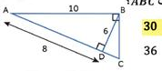
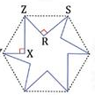
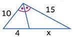
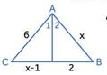
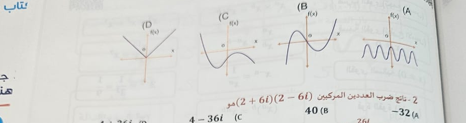
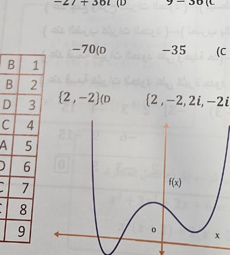
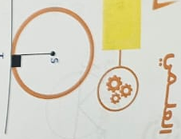
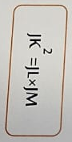
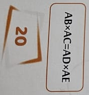

# Arabic Math Exam Extraction — All Pages

_Generated from 8 input image(s)._

# image

## Q1

إذا كان $\triangle ABC \sim \triangle EFG$ فإن ..

- **A.** $\angle B \equiv \angle C$
- **B.** $\angle A \equiv \angle G$
- **C.** $\overline{AC} \equiv \overline{EF}$
- **D.** $\angle A \equiv \angle E$ ✅

## Q7

مثلثان متشابهان، أضلاع المثلث الأكبر $9, 15, 18$ نسبة التشابه بينهم $\frac{2}{3}$، فما محيط المثلث الأصغر؟

- **A.** 12
- **B.** 24
- **C.** 28 ✅
- **D.** 14

## Q11
*tag:* `تكرر 2023`

ما صورة النقطة $B(2,3)$ الناتجة من الإزاحة $(x, y) \rightarrow (x + 4, y - 5)$؟

- **A.** $(6,0)$
- **B.** $(4,5)$
- **C.** $(6,-2)$ ✅
- **D.** $(-2,6)$

## Q16

ما محيط المثلث $ABC$؟

- **A.** 24
- **B.** 30 ✅
- **C.** 32
- **D.** 36

## Q17

كم عدد أضلاع المضلع المنتظم الذي قياس زاويته الداخلية $135^\circ$؟

- **A.** 4
- **B.** 8 ✅
- **C.** 5
- **D.** 7

## Q18

سداسي منتظم صُنعَت منه شجرة مشابك بقص ستة مثلثات قائمة متساوية ومتطابقة، بحيث كانت أحرف السداسي أوزانًا في المثلثات المقطوعة، وكان $m\angle XYZ = 45^\circ$، أوجد $m\angle XZR$.

- **A.** 30^\circ ✅
- **B.** 45^\circ
- **C.** 60^\circ
- **D.** 50^\circ

## Q26

قيمة $x$ في الشكل تساوي..

- **A.** 1
- **B.** 6 ✅
- **C.** 8
- **D.** المعطيات غير كافية

## Q27

في الشكل المقابل: إذا كان $m\angle 1 = m\angle 2$ فما قيمة $x$؟

- **A.** 4
- **B.** 3 ✅
- **C.** 6
- **D.** 5

## Q46

في المعين $ABCD$ ما قيمة $x$؟

- **A.** 30^\circ
- **B.** 20^\circ
- **C.** 120^\circ ✅
- **D.** 60^\circ

## Q50

في المعين $ABCD$، إذا كان $AC = 10$ و $BD = 24$، فاوْجد طول ضلع المعين.

- **A.** 5
- **B.** 8
- **C.** 13 ✅
- **D.** 15

# WhatsApp_Image_2026-01-11_at_3.08.37_PM

## Q1

أي الدوال التالية لها ثلاث أصفار حقيقية

- **A.** 
- **B.**  ✅
- **C.** 
- **D.** 

## Q2

ناتج ضرب العددين المركبين $2 + 6i$ و $2 - 6i$ هو

- **A.** -32
- **B.** 40 ✅
- **C.** 4 - 36i
- **D.** 4 + 36i

## Q3

ما قيمة $\frac{26i}{3-2i}$ ؟

- **A.** 36 - 27i
- **B.** 3 + 6i
- **C.** -4 - 6i
- **D.** -4 + 6i ✅

## Q4

قيمة $i^{25}$ تساوي

- **A.** i
- **B.** -1
- **C.** 1 ✅
- **D.** -i

## Q5

قيمة $i^{12}$ تساوي

- **A.** 1 ✅
- **B.** -1
- **C.** i
- **D.** -i

## Q6

9 - 36i (C    27 + 36i (D    9 + 36i (B    36 - 27i (A

- **A.** 36 - 27i
- **B.** 9 + 36i
- **C.** 9 - 36i
- **D.** 27 + 36i ✅

## Q7

حيث $i = \sqrt{-1}$ فإن $5i(7i) = ...$

- **A.** 70
- **B.** -70
- **C.** 35 ✅
- **D.** -35

## Q8

مجموعة حل المعادلة $x^4 - 16 = 0$ هي

- **A.** \{4, -4\}
- **B.** \{4\}
- **C.** \{2, -2, 2i, -2i\} ✅
- **D.** \{2, -2\}

## Q9

كم صفرا حقيقيا للدالة الممثلة المقابلة

- **A.** 1
- **B.** 2 ✅
- **C.** 3
- **D.** 4

# WhatsApp_Image_2026-01-11_at_3.08.38_PM_1

# WhatsApp_Image_2026-01-11_at_3.08.38_PM

# WhatsApp_Image_2026-01-11_at_3.08.39_PM_2

# WhatsApp_Image_2026-01-11_at_3.08.39_PM_3

## Q1

المقطع المستقيم المرسوم من مركز الدائرة إلى نقطة على الدائرة يسمى ...

- **A.** الوتر
- **B.** القطر
- **C.** المماس
- **D.** نصف القطر

## Q2

الزاوية الناتجة من تقاطع مماسين من نقطة خارج الدائرة تساوي ...

- **A.** $\frac{1}{2}(x-y)$
- **B.** $x-y$
- **C.** $x+y$
- **D.** $2x$

## Q3

الزاوية الناتجة من تقاطع وترين داخل الدائرة تساوي ...

- **A.** $\frac{1}{2}(x+y)$
- **B.** $x+y$
- **C.** $x-y$
- **D.** $2x$

## Q4

الزاوية الناتجة من تقاطع قاطع مع قاطع أو قاطع مع مماس خارج الدائرة تساوي ...

- **A.** $\frac{1}{2}(x-y)$
- **B.** $x-y$
- **C.** $x+y$
- **D.** $2x$

## Q5

إذا كان $JK^2 = IK 	imes KM$ فإن النقطة $K$ تقع على ...

- **A.** الوتر
- **B.** المماس
- **C.** الدائرة
- **D.** القطر

## Q6

إذا كان $AB 	imes AC = AD 	imes AE$ فإن النقاط $A, B, C, D, E$ تقع على ...

- **A.** مستقيم واحد
- **B.** دائرة واحدة
- **C.** مستوي واحد
- **D.** مماس واحد

# WhatsApp_Image_2026-01-11_at_3.08.40_PM_5

# WhatsApp_Image_2026-01-11_at_3.08.40_PM_6

## Q1

ناتج $1 + 1i$ هو:

- **A.** 1
- **B.** 1 + 1i ✅
- **C.** 1i
- **D.** 0

## Q2

ناتج $8 + 4i \, (0$ هو:

- **A.** 4 + 4i
- **B.** 8 + 4i ✅
- **C.** 8i
- **D.** 16

## Q3

ناتج $15 + 15i \, (0$ هو:

- **A.** 15i
- **B.** 15
- **C.** 1
- **D.** 0 ✅

## Q4

الصيغة الجبرية لعدد مركب هو:

- **A.** $a + bi$ ✅
- **B.** $a - bi$
- **C.** $a + b$
- **D.** $a - b$

## Q5

ناتج ضرب العددين المركبين $-32$ و $40$ هو:

- **A.** -32 ✅
- **B.** 40
- **C.** 4 - 36i
- **D.** 4 + 36i

## Q6

ناتج ضرب العددين المركبين $5(\cos 40^\circ + i \sin 40^\circ)$ و $3(\cos 50^\circ + i \sin 50^\circ)$ هو:

- **A.** $i(2 + 6i)(2 - 6i)$
- **B.** $i$
- **C.** $i(2 + 6i)(2 + 6i)$ ✅
- **D.** $-i$

## Q7

إذا كان $z = 3 - \sqrt{5}$ فإن $z = 3 - \sqrt{5}$ هو:

- **A.** $\sqrt{15}$
- **B.** $\sqrt{14}$
- **C.** $64\sqrt{3}$ ✅
- **D.** $64$

## Q8

إذا كان $z = 5 + 5\sqrt{3}$ فإن $z = 5 + 5\sqrt{3}$ هو:

- **A.** 27 ✅
- **B.** 30
- **C.** 41
- **D.** 60

## Q9

إذا كان $z = 7\cos \frac{\pi}{3} + i\sin \frac{\pi}{3}$ فإن $|z|$ يساوي:

- **A.** 7 ✅
- **B.** 4
- **C.** 41
- **D.** 90

## Q10

إذا كان $z = 100\cos \frac{\pi}{3} + i\sin \frac{\pi}{8}$ و $z = 10\cos \frac{\pi}{3} + i\sin \frac{\pi}{10}$ فإن $|z|$ يساوي:

- **A.** 225^0
- **B.** 180^0
- **C.** 120^0 ✅
- **D.** 90^0
