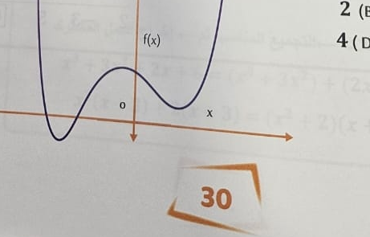

# Page 30 - extraction preview

## Q1

أي الدوال التالية لها ثلاث أصفار حقيقية؟

- **A.** 
- **B.**  ✅
- **C.** 
- **D.** 

## Q2

ناتج ضرب العددين المركبين (2 + 6i)(2 - 6i) هو

- **A.** 32-36i
- **B.** 40 ✅
- **C.** 4-36i
- **D.** 4+36i

## Q3

قيمة 3(3+6i)^2 تساوي

- **A.** 36-27i
- **B.** 9+36i
- **C.** 9-36i
- **D.** -27+36i ✅

## Q4

5i(7i) =

- **A.** 70
- **B.** -70
- **C.** -35 ✅
- **D.** 35

## Q5

حيث i = \sqrt{-1} فإن i^{12} تساوي

- **A.** 1 ✅
- **B.** -1
- **C.** i
- **D.** -i

## Q6

قيمة \frac{2}{i} تساوي

- **A.** i
- **B.** -i
- **C.** -2i ✅
- **D.** 2i

## Q7

4 + 36i =

- **A.** -4+36i
- **B.** -4-36i ✅
- **C.** 4-36i
- **D.** 4+36i

## Q8

مجموعة حل المعادلة 16 = x^4 هي

- **A.** {4, -4}
- **B.** {4}
- **C.** {2, -2, 2i, -2i} ✅
- **D.** {2, -2}

## Q9

كم صفراً حقيقياً للدالة الممثلة في المقابلة

- **A.** 1
- **B.** 2 ✅
- **C.** 3
- **D.** 4

