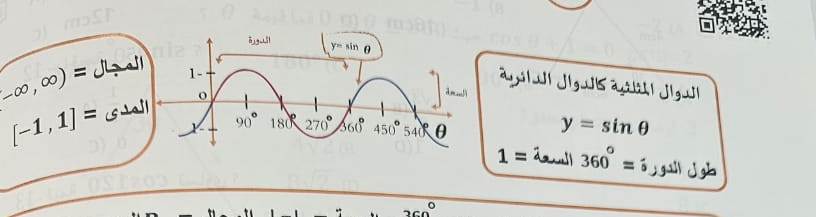

# Page 53 - extraction preview

## Q1

عند تبسيط العبارات المثلثية نستخدم ثلاث علاقات هامة لبدائل الدوال المثلثية

- **A.** 
- **B.** 
- **C.** 
- **D.** 

## Q2

\sin^2 \theta + \cos^2 \theta = 1

- **A.** 
- **B.** 
- **C.** 
- **D.** 

## Q3

\tan^2 \theta + 1 = \sec^2 \theta

- **A.** 
- **B.** 
- **C.** 
- **D.** 

## Q4

1 + \cot^2 \theta = \csc^2 \theta

- **A.** 
- **B.** 
- **C.** 
- **D.** 

## Q5

\sin \theta = \frac{1}{\csc \theta}

- **A.** 
- **B.** 
- **C.** 
- **D.** 

## Q6

\cos \theta = \frac{1}{\sec \theta}

- **A.** 
- **B.** 
- **C.** 
- **D.** 

## Q7

\tan \theta = \frac{1}{\cot \theta}

- **A.** 
- **B.** 
- **C.** 
- **D.** 

## Q8

\csc \theta = \frac{1}{\sin \theta}

- **A.** 
- **B.** 
- **C.** 
- **D.** 

## Q9

\sec \theta = \frac{1}{\cos \theta}

- **A.** 
- **B.** 
- **C.** 
- **D.** 

## Q10

\cot \theta = \frac{1}{\tan \theta}

- **A.** 
- **B.** 
- **C.** 
- **D.** 

## Q11

استنتاجات الدوال المثلثية

- **A.** 
- **B.** 
- **C.** 
- **D.** 

## Q12

\sin(-\theta) = -\sin(\theta)

- **A.** 
- **B.** 
- **C.** 
- **D.** 

## Q13

\cos(-\theta) = \cos(\theta)

- **A.** 
- **B.** 
- **C.** 
- **D.** 

## Q14

\tan(-\theta) = -\tan(\theta)

- **A.** 
- **B.** 
- **C.** 
- **D.** 

## Q15

حل المعادلات المثلثية ومراجعة جيب الحل

- **A.** 
- **B.** 
- **C.** 
- **D.** 

## Q16

الدوال العكسية كجدول الدوال الدائرية
y = \sin^{-1} x
المجال = [-1, 1]
المدى = \left[ -\frac{\pi}{2}, \frac{\pi}{2} \right]

- **A.** 
- **B.** 
- **C.** 
- **D.** 

## Q17

الدوال العكسية كجدول الدوال الدائرية
y = \cos^{-1} x
المجال = [-1, 1]
المدى = [0, \pi]

- **A.** 
- **B.** 
- **C.** 
- **D.** 

## Q18

الدوال العكسية كجدول الدوال الدائرية
y = \tan^{-1} x
المجال = ( -\infty, \infty )
المدى = \left( -\frac{\pi}{2}, \frac{\pi}{2} \right)

- **A.** 
- **B.** 
- **C.** 
- **D.** 

## Q19

الدوال العكسية كجدول الدوال الدائرية
y = \arcsin(b\theta)
طول الدورة = \frac{360}{|b|}
المدى = [-1, 1]

- **A.** 
- **B.** 
- **C.** 
- **D.** 

## Q20

الدوال العكسية كجدول الدوال الدائرية
y = \arccos(b\theta)
طول الدورة = \frac{360}{|b|}
المدى = [-1, 1]

- **A.** 
- **B.** 
- **C.** 
- **D.** 

## Q21

الدوال العكسية كجدول الدوال الدائرية
y = \arctan(b\theta)
طول الدورة = \frac{180}{|b|}
المدى = ( -\infty, \infty )

- **A.** 
- **B.** 
- **C.** 
- **D.** 
