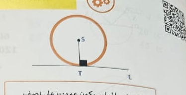
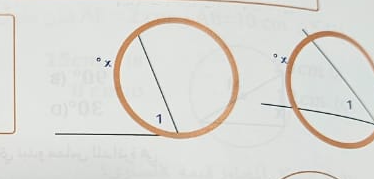
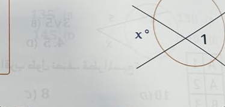
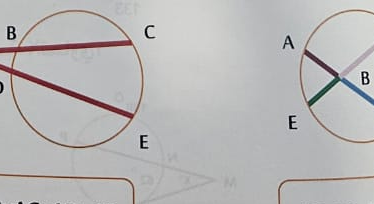
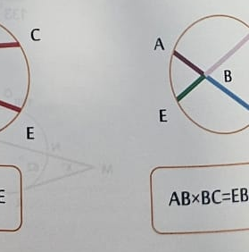

# Page 20 - extraction preview

## Q1

المستقيم المماس يكون عمودياً على نصف القطر المرسوم من نقطة التماس.

- **A.** 
- **B.** 
- **C.** 
- **D.** 

## Q2

المقاطع المماسات المرسومان من نقطة خارج دائرة متطابقان.

- **A.** 
- **B.** 
- **C.** 
- **D.** 

## Q3

الزاوية المماسية الزاوية المحيطية تساوي نصف قياس القوس المقابل
m∠1 = \frac{1}{2}x

- **A.** 
- **B.** 
- **C.** 
- **D.** 

## Q4

الزاوية الناتجة من تقاطع وترين داخل الدائرة
m∠1 = \frac{1}{2}(x + y)

- **A.** 
- **B.** 
- **C.** 
- **D.** 

## Q5

الزاوية الناتجة من تقاطع وترين خارج دائرة أو مماسين أو وتر ومماس
m∠1 = \frac{1}{2}(x - y)

- **A.** 
- **B.** 
- **C.** 
- **D.** 

## Q6

JK^2 = JL × JM

- **A.** 
- **B.** 
- **C.** 
- **D.** 

## Q7

AB × AC = AD × AE

- **A.** 
- **B.** 
- **C.** 
- **D.** 

## Q8

AB × BC = EB × BD

- **A.** 
- **B.** 
- **C.** 
- **D.** 

