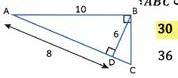
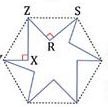
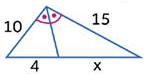
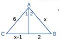
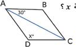
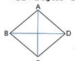

# Page 8 — extraction preview

## Q1

إذا كان $\triangle ABC \sim \triangle EFG$ فإن ..

- **A.** $\angle B \equiv \angle C$
- **B.** $\angle A \equiv \angle G$
- **C.** $\overline{AC} \equiv \overline{EF}$
- **D.** $\angle A \equiv \angle E$  ✅

## Q7

مثلثان متشابهان، أضلاع المثلث الأكبر $9, 15, 18$ نسبة التشابه بينهم $\frac{2}{3}$، فما محيط المثلث الأصغر؟

- **A.** 12
- **B.** 24
- **C.** 28  ✅
- **D.** 14

## Q11
*tag:* `تكرر 2023`

ما صورة النقطة $B(2,3)$ الناتجة من الإزاحة $(x, y) \rightarrow (x + 4, y - 5)$؟

- **A.** $(6,0)$
- **B.** $(4,5)$
- **C.** $(6,-2)$  ✅
- **D.** $(-2,6)$

## Q16

ما محيط المثلث $ABC$؟

- **A.** 24
- **B.** 30  ✅
- **C.** 32
- **D.** 36

## Q17

كم عدد أضلاع المضلع المنتظم الذي قياس زاويته الداخلية $135^\circ$؟

- **A.** 4
- **B.** 8  ✅
- **C.** 5
- **D.** 7

## Q18

سداسي منتظم صُنعَت منه شجرة مشابك بقص ستة مثلثات قائمة متساوية ومتطابقة، بحيث كانت أحرف السداسي أوزانًا في المثلثات المقطوعة، وكان $m\angle XYZ = 45^\circ$، أوجد $m\angle XZR$.

- **A.** 30^\circ  ✅
- **B.** 45^\circ
- **C.** 60^\circ
- **D.** 50^\circ

## Q26

قيمة $x$ في الشكل تساوي..

- **A.** 1
- **B.** 6  ✅
- **C.** 8
- **D.** المعطيات غير كافية

## Q27

في الشكل المقابل: إذا كان $m\angle 1 = m\angle 2$ فما قيمة $x$؟

- **A.** 4
- **B.** 3  ✅
- **C.** 6
- **D.** 5

## Q46

في المعين $ABCD$ ما قيمة $x$؟

- **A.** 30^\circ
- **B.** 20^\circ
- **C.** 120^\circ  ✅
- **D.** 60^\circ

## Q50

في المعين $ABCD$، إذا كان $AC = 10$ و $BD = 24$، فاوْجد طول ضلع المعين.

- **A.** 5
- **B.** 8
- **C.** 13  ✅
- **D.** 15
