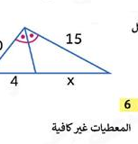
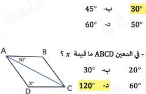
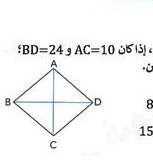

# Page 8 - extraction preview

## Q1

إذا كان \( \triangle ABC \sim \triangle EFG \) فإن ...

- **A.** \( \angle A \equiv \angle E \) ✅
- **B.** \( \angle A \equiv \angle G \)
- **C.** \( AC \equiv EF \)
- **D.** \( AB \equiv EF \)

## Q7

مثلثان متشابهان، أطوال أضلاع المثلث الأكبر 9, 15, 18 ونسبة التشابه 2 : 3، فما محيط المثلث الأصغر؟

- **A.** 26
- **B.** 14
- **C.** 24
- **D.** 28 ✅

## Q11

ما صورة النقطة B(2,3) الناتجة من الإزاحة (x, y) → (x + 4, y – 5)؟

- **A.** (4, -5)
- **B.** (6, 0)
- **C.** (6, -2) ✅
- **D.** (-2, 6)

## Q16

ما محيط المثلث ABC؟

- **A.** 36
- **B.** 30 ✅
- **C.** 32
- **D.** 24

## Q17

كم عدد أضلاع المضلع المنتظم الذي قياس زاويته الداخلية 135°؟

- **A.** 6
- **B.** 5
- **C.** 8 ✅
- **D.** 7

## Q18

خماسي منتظم انطلقت منه قائمة الزاوية ومماسية تتقاطعان في نقطة داخلية، إذا كان قياس الزاوية المحصورة بين المماس والقائمة 45°، فما قياس الزاوية \( m	riangle XZR \)؟

- **A.** 30° ✅
- **B.** 45°
- **C.** 60°
- **D.** 50°

## Q26

قيمة x في الشكل تساوي:

- **A.** 4
- **B.** 6 ✅
- **C.** 8
- **D.** المعطيات غير كافية

## Q27

في الشكل المقابل، إذا كان \( m1 = m2 \) فما قيمة x؟

- **A.** 4 ✅
- **B.** 6
- **C.** 5
- **D.** 2

## Q46

في المعين ABCD ما قيمة x؟

- **A.** 30°
- **B.** 60°
- **C.** 120° ✅
- **D.** 90°

## Q50

في المعين ABCD، إذا كان AC=10 و BD=24، فأوجد طول ضلع المعين.

- **A.** 8
- **B.** 15
- **C.** 13 ✅
- **D.** 5

